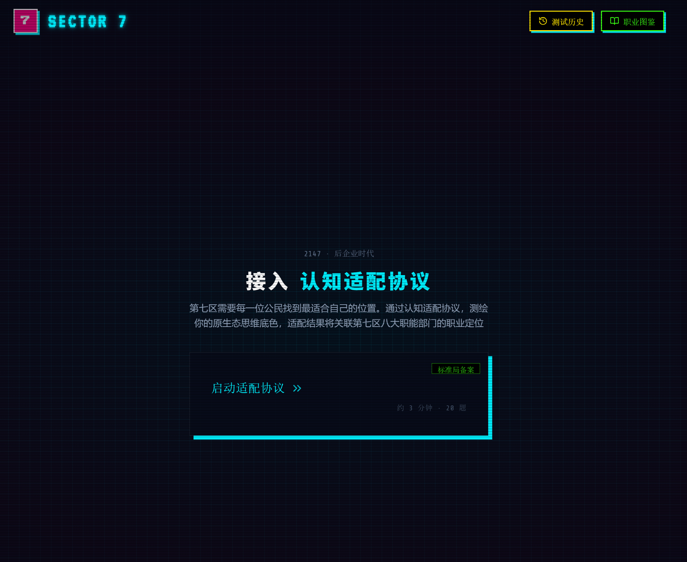

# CogniStyle · 认知风格测评系统

- 在线测评网址：[https://ultraseven.top/](https://ultraseven.top/)


> **第七区认知适配协议 · 2147 · 后企业时代**

CogniStyle 是一个沉浸式赛博朋克主题的在线认知风格测评系统。通过精心设计的 Likert 量表问卷，评估用户在多个认知维度上的偏好倾向，并结合"第七区（Sector 7）"世界观，为每位受测者匹配独特的职能身份与职业定位。


## 核心功能

### 认知测评
基于多维度认知风格理论，从以下维度评估用户思维偏好：

| 维度 | 两极 | 说明 |
|------|------|------|
| **认知节奏** | 冲动型 ↔ 反思型 | 行动驱动 vs 深度推演 |
| **信息策略** | 聚合型 ↔ 发散型 | 规范收敛 vs 多维探索 |
| **视野焦点** | 整体型 ↔ 分析型 | 宏观俯瞰 vs 局部细雕 |
| **协作偏好** | 独行型 ↔ 协同型 | 独立沉浸 vs 团队共振 |
| **知识表征** | 言语型 ↔ 表象型 | 文字逻辑 vs 视觉空间 |



### 世界观融合
测评结果以"第七区"赛博朋克世界观包装，输出包含：
- **4 大职能行会**：筑基者、守门人、探路者、炼金师
- **8 大职能部门**：应急局、边界署、医疗部、黑市工坊、总控中心、标准局、遗迹司、生科所
- **16 种认知身份**：先遣机师、禁区游侠、战地孤医、基因织匠等
- **像素风头像**：每个身份配备独特的 SVG 像素角色


### 双人互补报告
- **双人认知配对**：输入好友的识别码，生成双方认知互补度分析报告
- **四维拆解**：认知互补、协作兼容、盲区覆盖、摩擦风险四大维度量化评分
- **搭档类型识别**：镜像搭档 / 拼图搭档 / 齿轮搭档 / 火花搭档
- **行动建议**：适合一起做的事、优先规避场景、沟通建议
- **公开分享**：生成分享链接，对方打开后自动同步到历史记录


### 其他功能
- **测试历史**：自动记录所有双人测试，支持查看、重新打开、删除

- **URL 分享**：通过 URL 参数直接分享测评结果
- **职业图鉴**：内置完整的认知风格全图鉴手册
- **会话恢复**：支持刷新后恢复测评进度


## 技术栈

| 技术 | 用途 |
|------|------|
| **React 19** | 用户界面框架 |
| **TypeScript** | 类型安全 |
| **Vite 6** | 构建与开发工具 |
| **Tailwind CSS v4** | 样式框架 |
| **Motion** | 动画引擎 |
| **Lucide React** | 图标库 |
| **html2canvas** | 结果截图导出 |


## 快速开始

### 环境要求
- Node.js 18+
- npm 9+

### 本地部署

项目采用**双服务架构**：Vite 前端 + API 模拟层，需要同时运行两个终端。

```bash
# 1. 安装依赖
npm install

# 2. 启动 API 模拟层（终端 1，先启动）
npm run dev:api
# 输出：[dev-server] API 模拟层已启动
#       [dev-server] 地址  : http://127.0.0.1:8788

# 3. 启动前端开发服务器（终端 2）
npm run dev
# 输出：➜  Local:   http://localhost:3000/
```

打开 `http://localhost:3000` 即可使用完整功能。本地 KV 为内存存储，重启 `dev-server.js` 时数据会被清空。

### EdgeOne Pages 部署

#### 部署兼容性

项目代码同时兼容 **EdgeOne Pages**、**Cloudflare Workers** 和 **本地 dev-server** 三种运行环境。

> 无论部署到哪个平台，代码都会自动检测并适配 KV 访问方式，**无需修改任何代码**。

#### 部署步骤

1. 将代码推送到 Git 仓库（GitHub / GitLab / Gitee）
2. 在 [EdgeOne Pages 控制台](https://console.cloud.tencent.com/edgeone/pages) 创建项目，导入仓库
3. 框架预设选择 **自定义**，构建命令 `npm run build`，输出目录 `dist`
4. EdgeOne 会自动执行 `npm install` 和 `npm run build`，无需本地手动构建

#### KV 存储配置

> 要使「保存并生成识别码」功能正常工作，必须在 EdgeOne Pages 项目中绑定 KV 命名空间。

**1. 创建 KV 命名空间**

在 EdgeOne Pages 控制台左侧菜单进入「KV 存储」→ 点击「创建命名空间」→ 输入名称（例如 `cognistyle-kv`）→ 记录命名空间 ID。

**2. 绑定到项目**

进入你的 Pages 项目 →「设置」→「绑定」→「添加」→ 选择 **KV 命名空间**：

| 配置项 | 填写内容 |
|--------|---------|
| 变量名 | `RESULT_SNAPSHOT_KV` |
| 类型 | KV 命名空间 |
| 命名空间 | 选择第 1 步创建的命名空间 |

**3. 重新部署**

绑定 KV 后需要**重新部署项目**才能生效。点击项目右上角「部署」→「重新部署」即可。

> 💡 源码中已预设了 `KV`、`kv`、`KV_STORE`、`MY_KV` 等多个已知变量名作为兜底。如果你习惯用其他变量名，`getSnapshotKv` 也会自动扫描 `globalThis` 找到任何具有 `get`/`put` 方法的 KV 对象。

#### SPA 路由配置

> EdgeOne Pages 默认只对存在的静态文件返回 200，访问 `/share/{token}` 等前端路由会返回 404。本项目通过 `public/_redirects` 文件配置 SPA 回退规则来解决此问题。

项目根目录 `public/_redirects` 文件内容（构建后会自动复制到 `dist/`）：

```
/api/*  /api/:splat  200     # API 请求不变，由 Edge Functions 处理
/*       /index.html   200     # 其余路径回退到 index.html（SPA 接管）
```

**原理**：EdgeOne Pages 兼容 Cloudflare 的 `_redirects` 格式。状态码 `200` 表示在原始 URL 下透传目标文件内容——用户看到的 URL 仍是 `/share/{token}`，但实际收到的是 `index.html`，之后由 `App.tsx` 前端路由解析 URL 并渲染 `PublicSharePage`。

> ⚠️ 如部署后分享链接仍 404，请检查 EdgeOne 控制台「项目设置 → 构建部署配置」是否已启用 SPA 模式（如有此开关），或确认 `dist/_redirects` 文件存在。

### 构建生产版本

```bash
# 构建
npm run build

# 本地预览生产构建
npm run preview
```

## 世界观：第七区（Sector 7）

> 2147 年，后企业时代。曾经的企业城邦在崩塌后重组为自治特区，七个大区各自维持着脆弱的秩序。这里没有英雄，只有维持系统运转的职能者。

### 四大行会

| 行会 | 英文名 | 信条 | 核心特质 |
|------|--------|------|----------|
| **筑基者** | The Standard Architects | 秩序不是束缚，是底线 | 聚合 × 整体 |
| **守门人** | The Quality Guardians | 漏洞必须消灭 | 聚合 × 分析 |
| **探路者** | The Visionary Pathfinders | 答案在未探索的黑暗里 | 发散 × 整体 |
| **炼金师** | The Precision Innovators | 突破发生在标准之前 | 发散 × 分析 |

### 八大部门

- **应急局** —— 城市崩坏时的第一道防线
- **边界署** —— 探索禁区与未知区域
- **医疗部** —— 前线救治与义体维护
- **黑市工坊** —— 非法但必要的定制服务
- **总控中心** —— 城市系统的神经中枢
- **标准局** —— 维持底层协议与质量底线
- **遗迹司** —— 打捞失落文明的技术遗产
- **生科所** —— 基因与生命的微观操控

## 评分与匹配机制

### 1. 维度得分归一化
- 测验每题采用 5 点 Likert 量表（1=非常不同意 ~ 5=非常同意）。
- 根据各维度的题目方向（正向/反向），计算原始得分，并归一化为 0 - 100% 的百分比分数，指向维度的右侧极性（即行动-反思、收敛-发散、整体-分析）。

### 2. 双原型混合态计算（欧氏距离法）
为避免刻板的二分法分类，系统引入了 **3维认知空间欧氏距离算法** 来计算用户与 8 个理想认知原型的契合度：
- **三维坐标映射**：将用户的“冲动-反思”（$x$）、“收敛-发散”（$y$）、“整体-分析”（$z$） 3 个维度的归一化得分作为实际坐标点 $P(x, y, z)$。
- **理想原型端点**：8 个认知原型在 3 维空间中对应 8 个理想顶点（例如 `I-C-W` 对应 $[0, 0, 0]$，`R-D-A` 对应 $[100, 100, 100]$）。
- **距离计算**：利用三维空间欧氏距离公式，计算用户坐标点与 8 个理想顶点之间的距离 $D$：
  $$D = \sqrt{(x_{target} - x)^2 + (y_{target} - y)^2 + (z_{target} - z)^2}$$
- **匹配度折算**：最大可能距离为 $\sqrt{100^2 \times 3} \approx 173.2$。将距离折算为 0 - 100% 的匹配度（距离越近，匹配度越高）：
  $$\text{MatchScore} = \max\left(0, 100 - \frac{D}{173.2} \times 100\right)$$

### 3. 主/副双形态决出与排序
- 算法对 8 个原型的匹配度降序排列。
- 匹配度最高的第 1 个作为**主形态（Primary Archetype）**，第 2 个作为**副形态（Secondary Archetype）**。
- **平局处理机制（稳定排序）**：在多个原型匹配度相同时，采用稳定排序（Stable Sort）机制，保留其在系统默认定义列表 `ARCHETYPE_KEYS` 中的先后次序（例如，当计算出多个 52% 的平局时，`I-C-A` 会优于 `I-D-A` 先决出）。
- 结合第四个独立维度（独立-协同，S/T）最终合成完整的双重职业身份，用于结果页面的双生头像混合视觉呈现与动态生成的双向融合 Essence 文案。

### 4. 双人互补度评分算法

双人互补度评分（`compatibility-report.js`）通过 **高斯核函数** 量化两个用户在 4 个维度上的互补程度。核心思想是：两人在某维度上的差异达到一个"最优差距"时互补分最高，太像或差太多都会降分。

$$\text{Score} = \text{floor} + (100 - \text{floor}) \times \exp\left(-\frac{(\Delta - \text{idealGap})^2}{2 \times \text{tolerance}^2}\right)$$

| 维度 | 对应原始分 | 最优差距(idealGap) | 含义 |
|------|-----------|-------------------|------|
| **节奏** | 冲动-反思 | 0.28 | 略有差异最佳，太一致或太极端都降分 |
| **策略** | 收敛-发散 | 0.38 | 中等差异最佳，一个收一个放很互补 |
| **视野** | 整体-分析 | 0.35 | 适度视野差异最佳 |
| **协作** | 独立-协同 | 0.08 | 越接近越好，容忍度低 |

#### 四维拆解

四个指标从不同角度衡量配对质量：

| 指标 | 计算方式 | 总分权重 |
|------|---------|---------|
| **认知互补** | 节奏×0.3 + 策略×0.35 + 视野×0.35 | **0.50** |
| **协作兼容** | 直接使用协作维度分 | 0.15 |
| **盲区覆盖** | 差异度×是否对侧×强度 | 0.25 |
| **摩擦风险** | 超阈值的线性映射（阈值为 0.35-0.65） | 0.10（逆） |

**总分** = CC×0.5 + Col×0.15 + BC×0.25 + (100-FR)×0.1

#### 搭档类型

| 类型 | 判定条件 | 含义 |
|------|---------|------|
| **镜像搭档** | 各维度 Δ<0.15，盲区<15 | 同款脑回路，同款盲区 |
| **拼图搭档** | 盲区≥60，0.25≤avgΔ≤0.65，协作≥60 | 各司所长，刚好补齐缺口 |
| **火花搭档** | 摩擦≥60 或差异过于极端 | 见面就吵，吵完就赢 |
| **齿轮搭档** | 以上都不是 | 精准咬合才能全速推进 |

#### 任务匹配

基于四维互补分，与 5 种任务类型进行加权匹配（满分 100，取 Top 3）：

$$\text{FitScore} = \sum \text{dimScore} \times \text{missionWeight}$$

| 任务 | 部门 | 权重偏好 |
|------|------|---------|
| 禁区探索 | 边界署 | 节奏 0.3 + 策略 0.3 + 视野 0.25 |
| 应急响应 | 应急局 | 节奏 0.35 + 协作 0.25 |
| 标准审计 | 标准局 | 视野 0.3 + 协作 0.4 |
| 黑市定制 | 黑市工坊 | 策略 0.35 + 视野 0.25 |
| 遗迹发掘 | 遗迹司 | 视野 0.35 + 协作 0.3 |

#### 当前分布（50,000 随机对模拟）

按当前题库的 25 题 Likert 结构、沿用现有单人归一化和双人互补公式，对随机生成的两名用户进行 50,000 次配对模拟，得到如下分布：

| 分数区间 | 标签 | 占比 |
|----------|------|------|
| 0 - 34 | 探索磨合 | 0.1% |
| 35 - 49 | 潜力搭档 | 15.1% |
| 50 - 64 | 适配 | 51.2% |
| 65 - 79 | 合拍 | 32.5% |
| 80 - 100 | 王牌 | 1.1% |

平均分：59.4 | 最低分：31 | 最高分：86

## 开源协议

本项目基于 Apache-2.0 协议开源。
