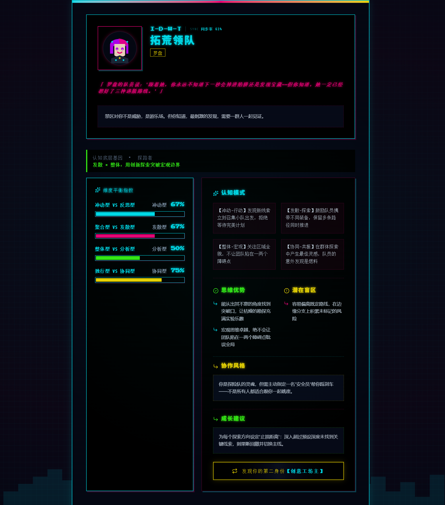
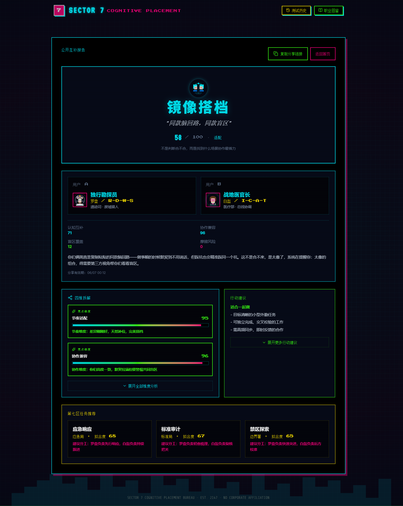
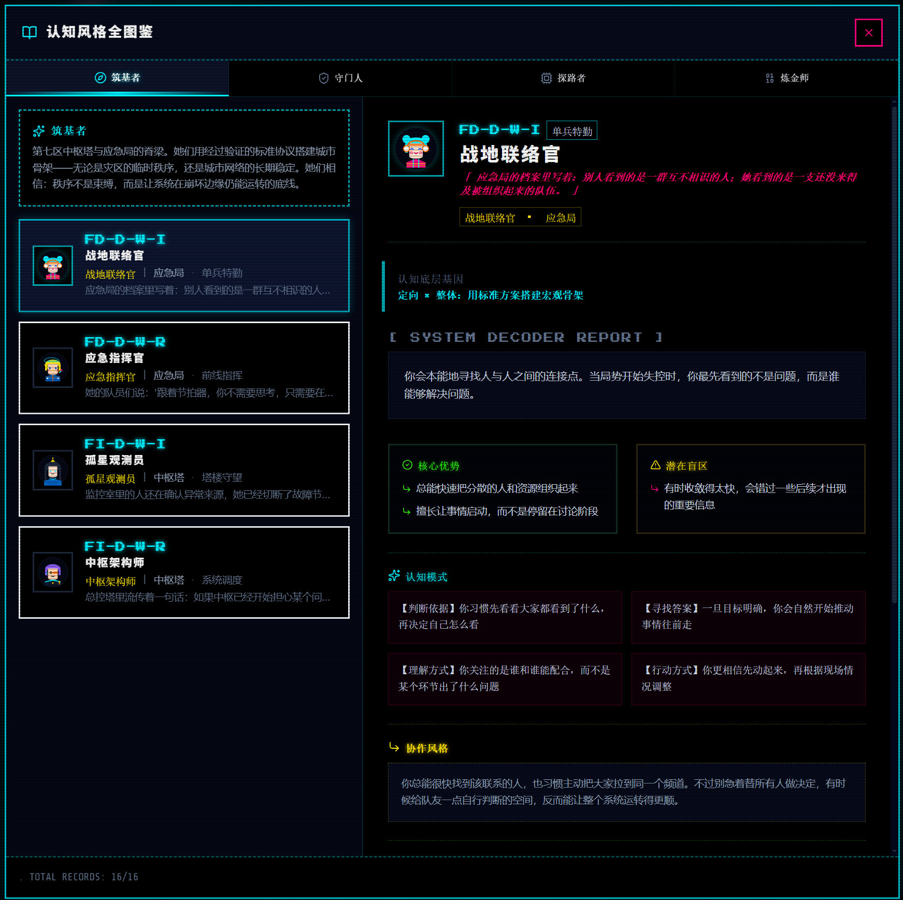

# CogniStyle · 认知风格测评系统

> **第七区认知适配协议 · Model v6.3 · 2147 · 后企业时代**

- 在线测评：<https://ultraseven.top/>

CogniStyle 是一个赛博朋克主题的认知风格测评系统。通过双端五档量表（Bipolar Scale），从 3 个核心认知维度 + 1 个风格标签维度评估用户的思维偏好，并结合"第七区"世界观匹配 16 种职能身份。支持双人互补报告（搭档指数计算），基于 50,000 次蒙特卡洛模拟校准评分参数。

***

## 核心功能

### 单人认知风格测评

4 维度双端五档量表，每道题提供两个对立但均合理的认知倾向供用户选择：

| 维度            | 层级   | 左极        | 右极        |
| ------------- | ---- | --------- | --------- |
| **信息参照（场定位）** | 核心认知 | 场独立（内部判断） | 场依赖（外部反馈） |
| **认知视角（视野）**  | 核心认知 | 整体（宏观结构）  | 分析（微观细节）  |
| **问题路径（方向）**  | 核心认知 | 探索（多路径发散） | 定向（单路径收敛） |
| **决策风格（节奏）**  | 风格标签 | 冲动（行动中修正） | 反思（行动前推演） |

> *双端五档量表——"先理解整体结构 ← → 先研究关键细节"*

结果页输出：

- **8 原型 × 2 风格 = 16 种职能身份**（如禁区游侠、中枢架构师）
- **三维认知空间欧氏距离匹配**：用户坐标与 8 个理想原型顶点的距离计算
- **主/副双身份**：匹配度最高的两个原型，含融合文案
- **维度平衡指数**：4 个维度的百分比可视化条形图
- **认知模式**：4 条结构化特质描述
- **SVG 像素风头像**：每个身份独占像素头像

> 
> *结果展示——身份卡、维度平衡指数、思维优势与潜在盲区*

### 双人互补报告

- **搭档指数**（0-100）：综合认知互补（60%）、盲区覆盖（15%）、节奏协同（10%）、摩擦风险反向（15%）的四子分加权
- **四种子分**：全部对应 UI 展示项，无隐藏黑箱
- **四种搭档关系**：
  | 模式            | 标签    | 占比（50k 模拟） |
  | ------------- | ----- | ---------- |
  | homogeneous   | 回声组   | 13.2%      |
  | complementary | 经纬组   | 12.6%      |
  | asymmetric    | 双星共轨组 | 73.9%      |
  | conflicting   | 化学反应组 | 0.3%       |
- **四维解读**：每个维度的差异类型判定（similar / moderate / complementary / opposite / friction + 20 段独立文案）
- **任务推荐**：5 个赛博朋克场景 × 动态角色分工 + 节奏提醒
- **行动建议**：每个 pattern 专属的行动指南

> 
> *双人互补报告——搭档指数、四维拆解、任务推荐与行动建议*

### 其他功能

- **测试历史**：localStorage 读写双人报告历史
- **公开分享**：脱敏分享链接（不含 friendId/个人信息）
- **职业图鉴**：16 种身份完整档案
- **会话恢复**：刷新后恢复测评进度

***

## 世界观：第七区（Sector 7）

> 2147 年，后企业时代。曾经的企业城邦在崩塌后重组为自治特区，七个大区各自维持着脆弱的秩序。



### 四大行会

| 行会      | 原型组合       | 信条              | 主色调          |
| ------- | ---------- | --------------- | ------------ |
| **筑基者** | D-W（定向×整体） | 秩序不是束缚，是底线      | `#00f0ff` 青  |
| **守门人** | D-A（定向×分析） | 什么可以被创造，什么必须被阻止 | `#ffe600` 黄  |
| **探路者** | E-W（探索×整体） | 边界之外仍有答案        | `#39ff14` 绿  |
| **炼金师** | E-A（探索×分析） | 突破发生在标准之前       | `#ff007f` 品红 |

### 八大部门

| 部门   | 行会  | 职责                 |
| ---- | --- | ------------------ |
| 应急局  | 筑基者 | 灾害响应、城市恢复、危机调度     |
| 总控中心 | 筑基者 | 城市 AI 网络、能源与基础设施管理 |
| 标准局  | 守门人 | 协议监管、AI 伦理审查、人格认证  |
| 医疗部  | 守门人 | 医疗系统、义体安全、生理维护     |
| 边界署  | 探路者 | 禁区探索、外域调查、未知文明接触   |
| 遗迹司  | 探路者 | AI 遗迹发掘、历史数据解码     |
| 黑市工坊 | 炼金师 | 非标准技术、义体改造、地下创新    |
| 生科所  | 炼金师 | 基因编辑、意识接口、生命工程     |

***

## 快速开始

### 本地部署

```bash
npm install
npm run dev:api       # 终端1：API 模拟层 http://127.0.0.1:8788
npm run dev           # 终端2：前端 http://localhost:3000
```

### 部署（EdgeOne Pages）

1. 推送到 Git 仓库 → [EdgeOne Pages 控制台](https://console.cloud.tencent.com/edgeone/pages) 创建项目
2. 框架预设 **自定义**，构建命令 `npm run build`，输出目录 `dist`
3. 创建 KV 命名空间并绑定（变量名 `RESULT_SNAPSHOT_KV`）
4. 重新部署

> `public/_redirects` 配置了 SPA 路由回退，确保 `/share/{token}` 正常工作。

### 命令

```bash
npm run dev              # 前端开发服务器
npm run dev:api          # API 模拟层
npm run build            # 生产构建
npm run lint             # TypeScript 类型检查
npm run tune:compatibility  # 50k 评分参数模拟验证
```

***

## 评分机制（摘要）

详细设计见 [§4-§9](doc/系统设计.md#4-单人计分模型)。

### 单人计分

双端五档量表（-2 强烈偏左 → +2 强烈偏右）：

```
强左  弱左  中间  弱右  强右
 -2    -1    0    +1    +2
```

维度聚合 + 百分比归一化 + **平衡区极性判定**（45-55 避免微小差异导致标签跳变）。

### 原型匹配

3 个核心维度（FI/FD, W/A, E/D）映射为 3 维认知空间坐标，与 8 个原型顶点欧氏距离匹配，取 Top 2 为主/副身份。加上风格标签维度（I/R）交叉形成 16 种职业子类型。

### 双人互补评分（Model v6.3）

```
partnerIndex = cogComp × 0.60 + blindSpot × 0.15 + rhythm × 0.10 + (100 − friction) × 0.15
```

- **认知互补度**（0.60）：F/V/D 三维高斯核评分（主驱动力）
- **盲区覆盖度**（0.15）：Δ^0.35 × 强度因子
- **节奏协同度**（0.10）：R 维度高斯核评分
- **摩擦风险**（0.15 反转）：4 维加权溢出风险

参数经 50,000 次随机配对模拟校准，详见 [§11](doc/系统设计.md#11-评分分布与校准结果)。

***

## 版本

当前：**v6.3**（2026-06-14）— 4 子分透明化、complementary 12.6%、conflicting 0.3%、50k 模拟验证通过。

完整变更记录见 [附录 B](doc/系统设计.md#附录-b版本记录)。
